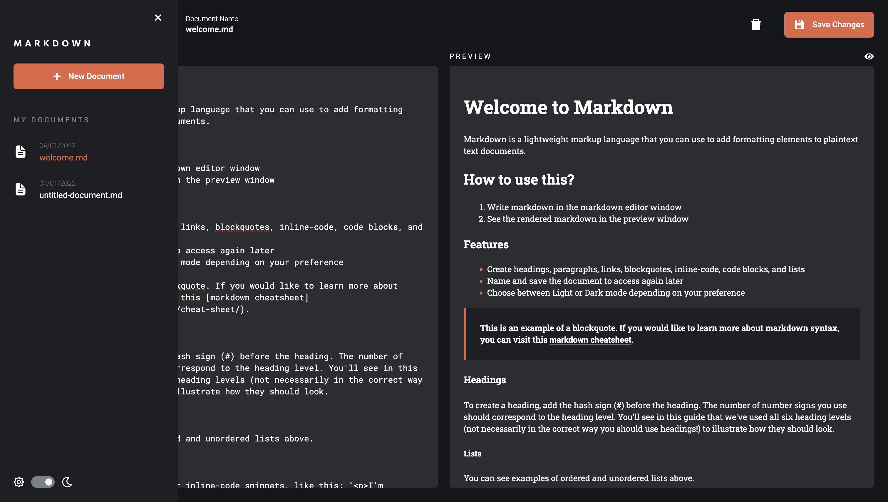
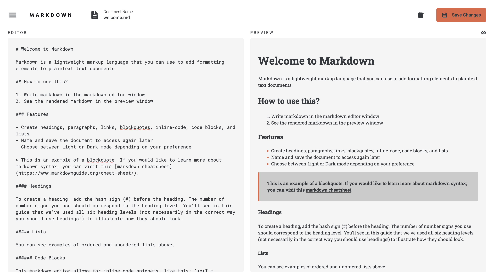

# In-browser Markdown Editor

## Features
- Intriguing UI/UX
- Light/Dark theme toggle
- Validates user inputs and data interactivity
- Expandible sidebar 
- Full Preview Mode 
- Persist data in local storage
- Lets the user to 
  - Hover & Focus over interactive components
  - Create, Read, Update, Delete markdown files 
  - Preview the realtime renders 
  - Customize the pledge amount as per wish 

 <br/>


## Built With
- ReactJS
- Redux 
- Vite 
- Tailwind CSS
- CSS3
- react-markdown 

### Links

- [Github URL](https://github.com/vansh2308/in-browser-markdown-editor.git)

## Usage

Navigate following commands in your terminal 

```bash
git clone https://github.com/vansh2308/in-browser-markdown-editor.git
cd ./in-browser-markdown-editor
npm i 
npm run dev 
```

Now type http://localhost:5173 in your browser. Bingo!!

## Author

- Github - [vansh2308](https://github.com/vansh2308)
- Website - [Vansh Agarwal](https://www.your-site.com)
- Frontend Mentor - [@vansh2308](https://www.frontendmentor.io/profile/vansh2308)